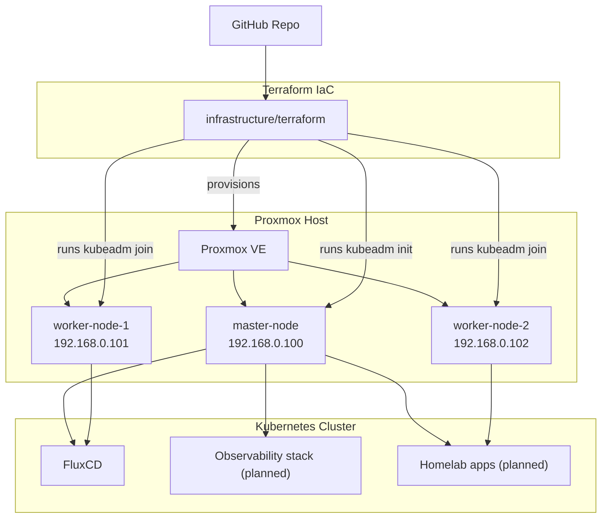

# Homelab

This repository codifies my homelab, built around a kubeadm-managed Kubernetes cluster that runs on Proxmox virtual machines. Terraform provisions the VMs, configures cloud-init, and bootstraps the control plane so the cluster is reproducible from this repo.

## Current Topology

- **Hypervisor:** Proxmox VE host on the home network (`192.168.0.250`).
- **Kubernetes:** One kubeadm control plane (`192.168.0.100`) and two workers (`192.168.0.101-102`) created via Terraform.
- **Networking:** All VMs attach to `vmbr0` on the main LAN; DNS and routing are provided by the home router (`192.168.0.1`).
- **Automation:** Terraform `null_resource` provisioners install containerd, the latest Kubernetes 1.34 kubeadm/kubelet/kubectl toolchain, initialize the control plane, and automatically join the worker nodes once they are reachable.
- **GitOps & Apps:** FluxCD reconciles the GitOps tree under `clusters/homelab`, managing networking, security, and storage add-ons (Cilium, cert-manager, External DNS, MetalLB, Longhorn, metrics-server) while serving as the landing zone for future workloads.

## Prerequisites & Quick Start

- **Proxmox VE 9** up and running; follow `docs/bootstrap.md` to create the reusable `ubuntu-noble` cloud-init template (import disk, attach cloud-init, convert to template).
- **SSH key in repo root**: run `ssh-keygen -t ed25519 -f id_ed25519` from the repository root so Terraform can use `id_ed25519`/`id_ed25519.pub`.
- **Proxmox API token** with QEMU VM privileges on the Datacenter (clone, rename, read, start/stop). Add the token values to `infrastructure/terraform/terraform.tfvars`.

Once prerequisites are in place:

1. `terraform -chdir=infrastructure/terraform apply` to clone the template VMs and install Kubernetes with kubeadm.
2. Copy the kubeconfig down (`scp -i id_ed25519 ubuntu@192.168.0.100:/etc/kubernetes/admin.conf kubeconfig`), replace the server IP if needed, run `chmod 600 kubeconfig`, and export `KUBECONFIG=$PWD/kubeconfig`.
3. Verify access with `kubectl get pods -A` or `kubectl get nodes -o wide`.
4. Update the sample app hostnames in `apps/sample-nginx/overlays/{staging,production}/domain.env`, commit the change, and let Flux reconcile both environments. Once the `sample-nginx-*` Kustomizations report Ready, reach the staging service via `http://<node-ip>:30080` or wait for DNS + TLS through the Ingress.

See `docs/bootstrap.md` for the full walkthrough and troubleshooting tips.

## Key Directories

- `infrastructure/terraform/` – Proxmox VM and kubeadm automation.
- `infrastructure/kubernetes/` – Scratchpad for manifests that have not yet been promoted into Flux (see README inside).
- `clusters/` – Flux GitOps tree for platform services and applications.
- `docs/` – Architecture notes, bootstrap instructions, and ADRs (see `docs/weave-gitops-ui.md` for the optional Flux UI).
- `apps/` – Base manifests for workloads; Flux Kustomizations under `clusters/homelab/apps/` reference these (e.g., sample nginx).

See `docs/architecture.md` for the full architecture narrative and `docs/bootstrap.md` for reproducible bootstrap steps.
