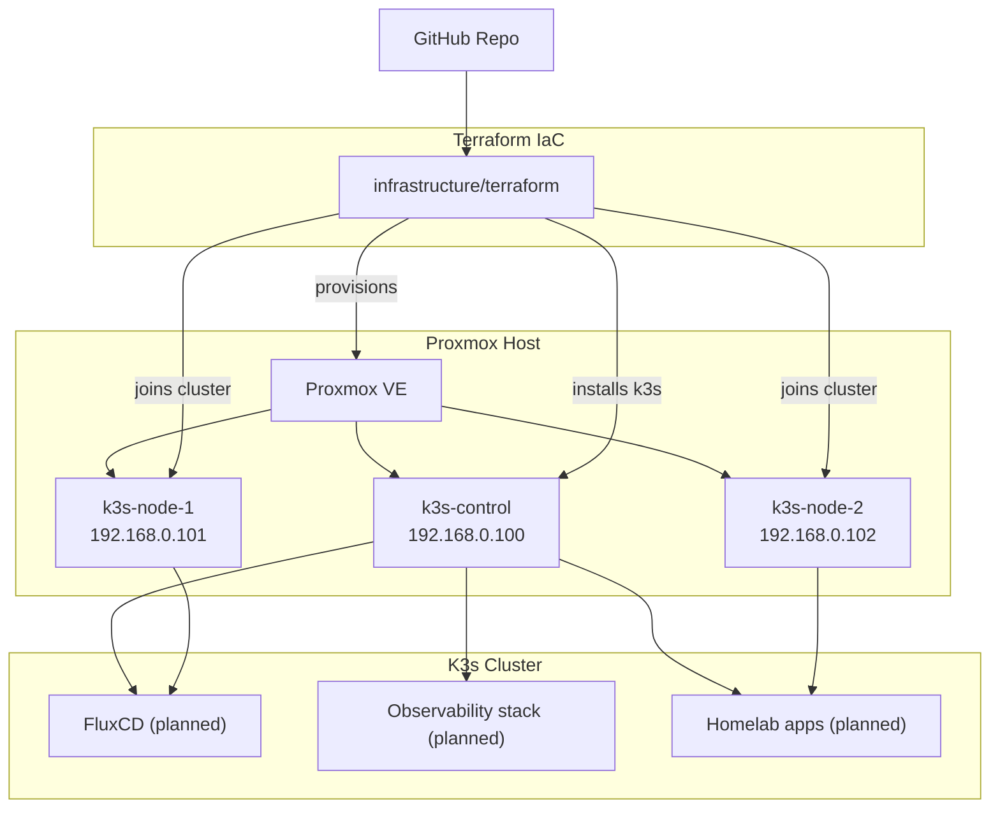

# Homelab

This repository codifies my homelab, built around a lightweight K3s cluster that runs on Proxmox virtual machines. Terraform provisions the VMs, configures cloud-init, and bootstraps K3s so the cluster is reproducible from this repo.

## Current Topology

- **Hypervisor:** Proxmox VE host on the home network (`192.168.0.250`).
- **Kubernetes:** K3s control-plane (`192.168.0.100`) and two workers (`192.168.0.101-102`) created via Terraform.
- **Networking:** All VMs attach to `vmbr0` on the main LAN; DNS and routing are provided by the home router (`192.168.0.1`).
- **Automation:** Terraform `null_resource` provisioners install K3s after the VMs come online, eliminating manual curl/sh steps.
- **GitOps & Apps (roadmap):** FluxCD, observability stack, and application manifests live under `clusters/` and will be expanded as the lab matures.

## Prerequisites & Quick Start

- **Proxmox VE 9** up and running; follow `docs/bootstrap.md` to create the reusable `ubuntu-noble` cloud-init template (import disk, attach cloud-init, convert to template).
- **SSH key in repo root**: run `ssh-keygen -t ed25519 -f id_ed25519` from the repository root so Terraform can use `id_ed25519`/`id_ed25519.pub`.
- **Proxmox API token** with QEMU VM privileges on the Datacenter (clone, rename, read, start/stop). Add the token values to `infrastructure/terraform/terraform.tfvars`.

Once prerequisites are in place:

1. `terraform -chdir=infrastructure/terraform apply` to clone the template VMs and install K3s.
2. Copy the kubeconfig down (`scp -i id_ed25519 ubuntu@192.168.0.100:/etc/rancher/k3s/k3s.yaml kubeconfig`), replace the server IP, run `chmod 666 kubeconfig`, and export `KUBECONFIG=$PWD/kubeconfig`.
3. Verify access with `kubectl get pods -A` or `kubectl get nodes -o wide`.
4. Deploy the sample workload: `kubectl apply -f apps/sample-nginx/` and browse `http://<node-ip>:30080`.

See `docs/bootstrap.md` for the full walkthrough and troubleshooting tips.

## Key Directories

- `infrastructure/terraform/` – Proxmox VM and K3s automation.
- `clusters/` – Flux GitOps tree for future workloads.
- `docs/` – Architecture notes, bootstrap instructions, and ADRs.
- `apps/` – Simple manifests for kubectl-driven tests (e.g., sample nginx).
- `assets/` – Diagrams and reference files.

See `docs/architecture.md` for the full architecture narrative and `docs/bootstrap.md` for reproducible bootstrap steps.
